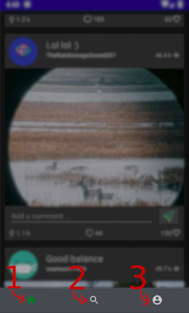
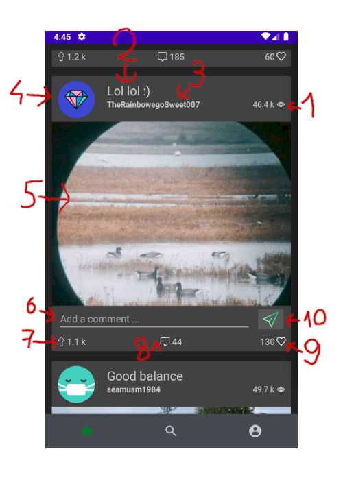
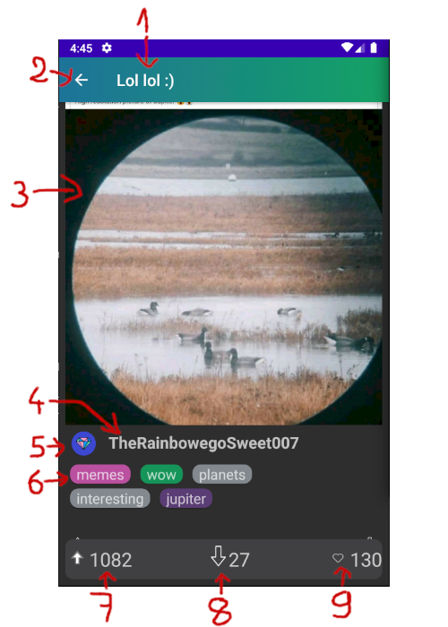
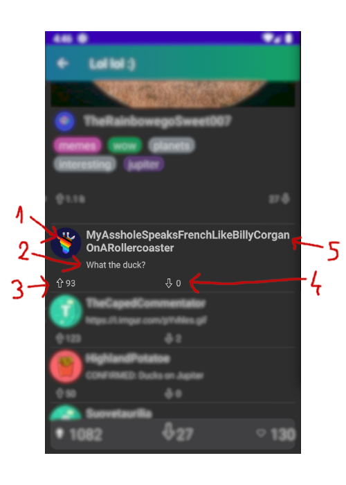
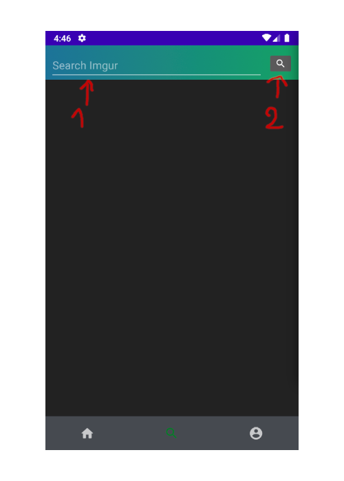
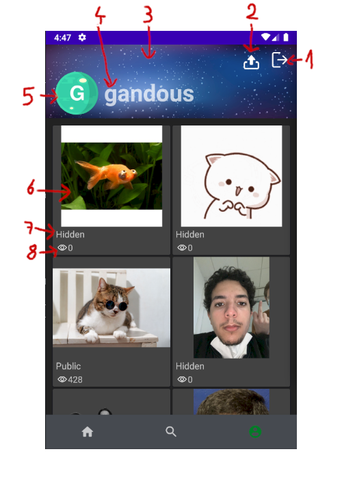

# User documenation

## App navigation
\
User the bar at the bottom of the ap to navigate between the different screen
1. Go to the feed view
2. Go to the search view
3. Go to your account view

## Feed view
Display your feed, you can scroll down to view more post. You can click on a post to view more detail about it.

1. Number of view
2. Author name
3. Gallery title
4. Author profil picture
5. Gallery thumbnail
6. Text zone for creating comment
7. Up vote number
8. Comment number
9. Favorite number
10. Send comment

### Detail gallery view
Dispay the image in full size. You can scroll down to the post comment.

1. Gallery title
2. Back to feed view
3. Image
4. Author name
5. Author profil picture
6. Image tags
7. Upvote button
8. Downvote button
9. Favorite button

### Detail gallery view comment

1. Comment author profil picture
2. Comment content
3. Comment upvote
4. Comment downvote
5. Comment author

## Search page

1. Search text
2. Search button

## Account page
Display information about the account and display all the post by the user.

1. Logout button
2. Upload button
3. Cover image
4. Username
5. User profil picture
6. User post cover image
7. Post visibility (Hidden/Public)
8. Number of view
